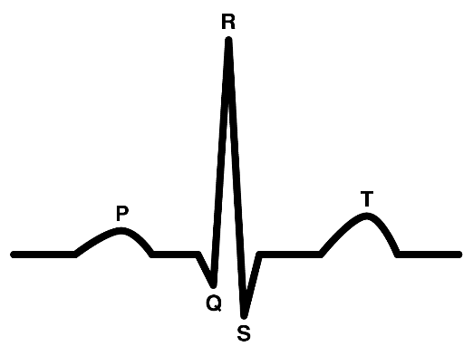
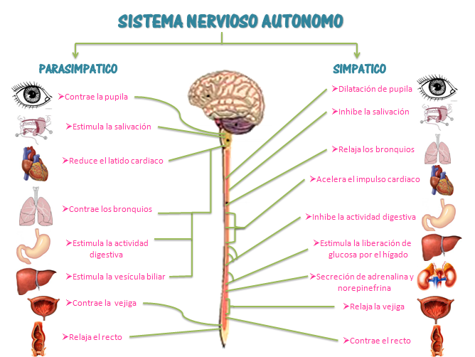
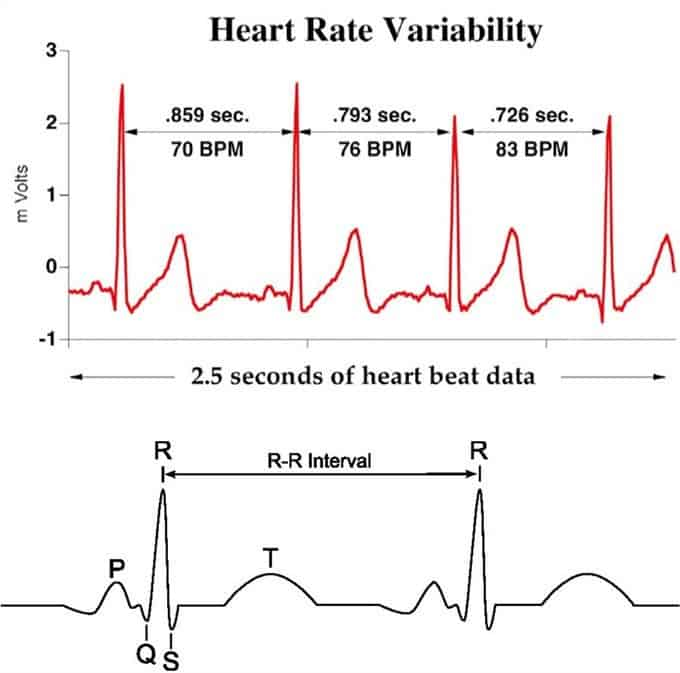
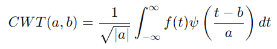
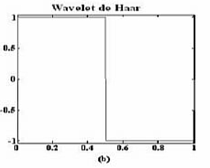
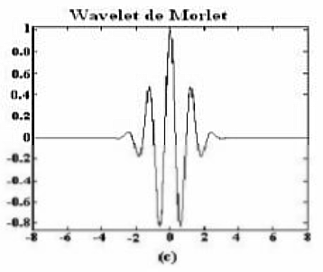
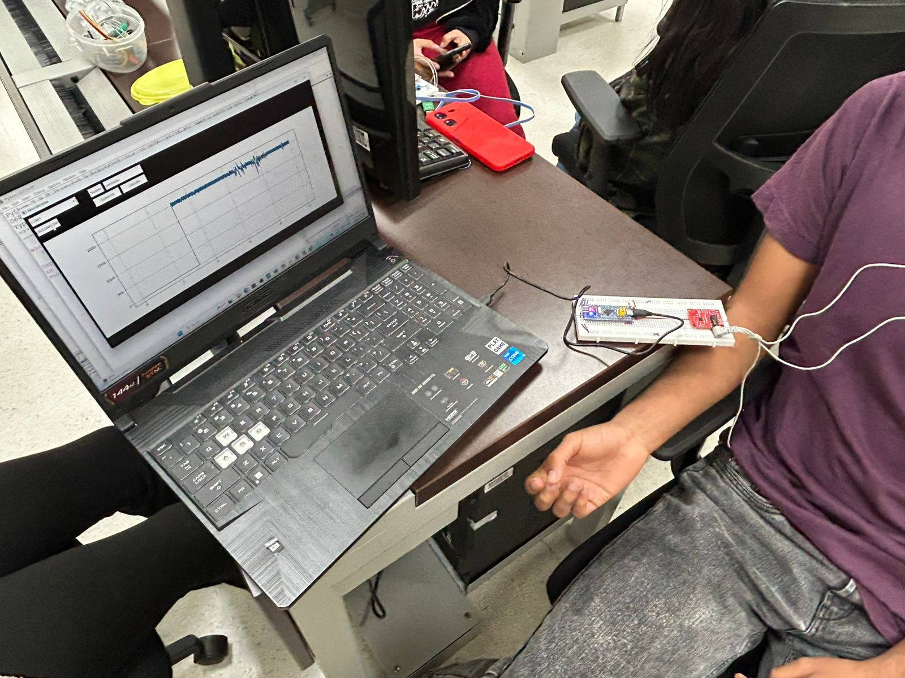
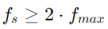

-*
<h1 align="center">ANÁLISIS DE SEÑAL ELECTROMIOGRÁFICA</h1>

<p align="center"> Problema:  Identificación de picos R, e intervalo entre ellos.</p>
<br />
<div align="center">
 
</div>

<br />

La señal ECG es aquella que mide la actividad eléctrica del corazón, en cada latido. Es capaz de medir los cambios de voltaje gracias al flujo de iones que sucede durante la contracción y relajación. Asimismo, cada parte de la señal ECG tiene un significado asociado con el ciclo cardíaco.

Teniendo en cuenta que nos interesa el significado del pico R, se define como la representación de la despolarización máxima de los ventrículos; siendo esta importante para enviar la sangre al resto del cuerpo.

Entonces, ¿qué ocurre durante el intervalo entre cada pico R? Este tiempo representa el periodo completo de un latido cardíaco, a partir del cual se puede calcular la frecuencia cardíaca (un importante indicador de la salud del paciente), y también evaluar su variabilidad (HRV). Pero, ¿para qué? Se profundizará más sobre esto en el marco teórico.


## Tabla de contenidos:
---

- [MARCO TEÓRICO](#marco)
- [OBJETIVO](#objetivo)
- [MONTAJE](#montaje)
- [PROCESAMIENTO DE LAS SEÑALES](#procesamiento)
- [ANÁLISIS DE RESULTADOS](#resultados)
- [APLICACIONES EN BIOMÉDICA](#aplicaciones)


## Marco teórico
---

### Sistema nervioso autónomo

El sistema nervioso autónomo es la parte del sistema nervioso que se encarga de controlar de manera automática las funciones involuntarias del cuerpo. Entre las características que este sistema regula se encuentra el ritmo cardíaco. Este control está presente en todas las situaciones a las que las personas se enfrentan, sin embargo, no todas las respuestas son iguales. Por esta razón, se divide en dos: sistema simpático y parasimpático.

El sistema simpático se activa en situaciones de peligro o estrés, preparando al cuerpo para la acción ("respuesta de lucha o huida"). Uno de sus principales efectos es aumentar la frecuencia cardíaca al liberar noradrenalina. Al latir más rápido el corazón, aumenta el flujo sanguíneo y el suministro de oxígeno a los órganos. Esto se refleja en un acortamiento del intervalo R-R, debido al aumento de la frecuencia cardíaca.

Por otro lado, el sistema parasimpático se activa en situaciones de relajación y descanso, favoreciendo la conservación de energía. Cuando se activa, disminuye la frecuencia de impulsos eléctricos del nodo sinusal (marcapasos cardíaco), lo que reduce el trabajo del corazón. Esto se refleja en un alargamiento del intervalo R-R, ya que la frecuencia cardíaca disminuye.

<div align="center">
 
</div>

### ¿Qué mide la HRV?

La HRV (Heart Rate Variability), o variabilidad de la frecuencia cardíaca, es una medida de los cambios en el tiempo que ocurren entre los latidos del corazón, a esto se le llama frecuencia. Anteriormente, se mencionó cómo el cuerpo se adapta a diferentes situaciones, lo que demuestra su adaptabilidad. Al analizar la HRV, es importante considerar las diferentes bandas de frecuencia, ya que cada una proporciona información sobre características específicas de la señal ECG.

<div align="center">
 
</div>

### Bandas de frecuencia que mide la HRV

Habiendo mencionado anteriormente que las frecuencias medidas por la HRV son equivalentes a las 'velocidades' a las que ocurren las variaciones de los intervalos R-R, es importante aclarar que existen dos bandas de frecuencia principales: baja frecuencia y alta frecuencia.

La banda de baja frecuencia se observa en un rango de 0.04 Hz a 0.15 Hz y se relaciona con cambios lentos en los intervalos R-R. Estos cambios lentos suelen estar asociados con la respuesta del cuerpo a situaciones de estrés o descanso, mientras busca alcanzar la homeostasis.

Por otro lado, la banda de alta frecuencia se encuentra en un rango de 0.15 Hz a 0.4 Hz y está relacionada con cambios rápidos en los intervalos R-R. Principalmente, esta banda se ve influenciada por la respiración, reflejando la regulación que el cuerpo ejerce sobre ella.

Entonces, ¿Cómo es posible medir el avance de dichas frecuencias?, para este objetivo se utiliza la herramienta de la Transformada Wavelet. 

### Transformada Wavelet

La transformada wavelet es una herramienta matemática que nos permite analizar cómo cambian las frecuencias a lo largo de una señal, descomponiéndola en 'escalas' de tiempo y frecuencia. Esto significa que la transformada puede proporcionarnos información sobre qué frecuencias están presentes y en qué momentos de la señal ocurren. Su definición matemática, teniendo en cuenta que se está aplicando una señal continua (es decir, se va a utilizar la Transformada Wavelet Continua) es la siguiente:

<div align="center">
 
</div>

Esta definición nos brinda dos datos de vital importancia para realizar la transformada, siendo así, cada término significa lo siguiente: 

> CWT(a,b)

Representa el coeficiente de la transformada Wavelet para una escala **a** y una traslación **b**, cabe recordar que la escala se relaciona con el cambio en la frecuencia, y la traslación con el movimiento en el eje x.

> 1/√a

Es el factor de normalización encargado de que la energía de la señal Wavelet no cambie junto con la variación en la escala. 

> f(t)

Es la señal que se quiere someter a la transformada Wavelet.


> ψ((t-b)/a)

Es la función Wavelet madre (es decir, la Wavelet sin ninguna modificación), pero, escalada en **a**, desplazada en **b** y evaluada en el tiempo **t**. 

Teniendo en cuenta su definición, ahora podemos ver cuáles aplicaciones tiene, y es que, al ser tan poderosa, se usa en campos que van desde la economía hasta la ingeniería. Por ejemplo, en el ámbito de las finanzas, se puede utilizar para analizar la evolución de series temporales financieras en distintas escalas de tiempo, como por ejemplo, las tasas de interés. Se puede aplicar para captar y analizar patrones, lo cual permite una comprensión profunda de las situaciones que pueden afectar al comportamiento económico que se esté considerando. Por otro lado, en el área de la ingeniería, se puede ver aplicada en distintos ámbitos, como en el presente en este laboratorio, de análisis de señales biológicas, o, por ejemplo, en el análisis de imágenes. En el análisis de imágenes se puede utilizar para eliminar información redundante a distintas escalas presente en la imagen que se esté procesando, logrando mejorar la comprensión de la misma sin perder información relevante. Pero, para aplicaciones tan diversas, ¿Siempre se usa la misma Wavelet?, la respuesta es: no. Existen distintos tipos de Wavelets. 

### Tipos de Wavelet 

Como se mencionó anteriormente, existen distintos tipos de wavelets, cada una con características especiales que las hacen aptas para diversas aplicaciones en diferentes áreas. A continuación, se mencionan las más importantes y la que se utilizó en este algoritmo. 

> Wavelet de Haar

Esta señal Wavelet es una muy simple, se basa en una función escalón, y es discontinua. Se puede utilizar para analizar imagenes, detectando estructuras bruscas en las señales que componen las mismas. Sin embargo, no es recomendada para utilizar en señales suaves ó demasiado complejas, por su condición de discontinuidad. 

<div align="center">
 
</div>

> Wavelet Daubechies 

Esta es una Wavelet suave y continua, se divide también en varios tipos, dependiendo de su orden y de su longitud. Se utiliza comunmente en procesamiento de imagenes y audio, puede detectar detalles finos.

<div align="center">
 
</div>

> Wavelet de Morlet  

Esta wavelet, que se asemeja a una señal sinusoidal pero con una forma similar a una campana de Gauss, permite obtener datos como la magnitud y la fase. Gracias a su naturaleza, es capaz de detectar estructuras periódicas en las señales. Por esta razón, se seleccionó para analizar la señal ECG.

<div align="center">
 
</div>


## Objetivo
---

El objetivo de este trabajo fue identificar los picos R de una señal ECG para, posteriormente, analizar la fluctuación temporal de los intervalos R-R en una señal de cinco minutos de duración. Esta información es fundamental para realizar un análisis de la frecuencia cardíaca y detectar posibles anomalías asociadas a enfermedades o síndromes. Para identificar las frecuencias relacionadas con estas fluctuaciones, se empleó la transformada wavelet de Morlet, lo que permitió generar un espectograma y visualizar gráficamente la evolución temporal de las frecuencias.

## Montaje
---

Para la toma de datos, en primer lugar, se obtuvo el consentimiento informado del sujeto de prueba, quien autorizó por escrito el uso y divulgación de los datos de su señal ECG. El documento de consentimiento se encuentra disponible con el nombre "CONSENTIMIENTO_SEÑALES". A continuación, se conectó al sujeto a los electrodos del sensor AD8232 y, mediante comunicación serial entre la STM32 y Python, se adquirieron cinco minutos de datos de la señal ECG. Finalmente, estos datos fueron almacenados en un archivo .txt, el cual servirá como base para el posterior procesamiento y extracción de las características requeridas de la señal.

<div align="center">
 
</div>


## Procesamiento de la señal ECG 
---
### 1. Cargar las librerias que serán utilizadas para procesar la señal 

Se utilizaron diversas librerias, tales como: 

- Numpy: Computación numerica, se utilizó para el procesamiento de matrices, arreglos y funciones matematicas. 
- Matplotlib: Graficacion de las señales. 
- Spicy.signal: Procesamiento de las señales. 
- Pywt: Utilizada para llevar a cabo la transformada Wavelet. 
- Panda: Se utilizó para mostrar de manera ordenada los datos en el panel de Spider, en forma de tablas, facilitando su comprensión. 

```
import numpy as np
import matplotlib.pyplot as plt
import scipy.signal as signal
import pywt
import pandas as pd
```
### 2. Cargar los datos guardados en el archivo .txt

El nombre del archivo de texto es 'juanitados'. Si se utiliza este código, se debe reemplazar por el nombre del archivo .txt correspondiente. Es importante destacar que los datos dentro del archivo están organizados en filas y columnas, por lo que es necesario especificar qué columnas corresponden al tiempo y al voltaje para construir la señal. La frecuencia de muestreo utilizada es de 100 Hz. Esta elección se basa en el teorema de Nyquist, que establece que la frecuencia de muestreo debe ser al menos el doble de la frecuencia máxima de la señal, la cual, según la literatura, oscila alrededor de 50 Hz.

<div align="center">
 
</div>

```
file_path = 'juanitados.txt' 
datos = np.loadtxt(file_path, delimiter=',') 
tiempo = datos[:, 0]  #Tiempo
voltaje = datos[:, 1]  #Voltaje 
fs = 100 #Frecuencia de muestreo (Hz)
```

### Paso 3: Aplicar el ICA

```
ica = FastICA(n_components=3)
sources = ica.fit_transform(audio_mezclado.reshape(-1, 1))
```
### Paso 4: Seleccionar la fuente (voz) que se desea filtrar

```
voz_filtrada = sources[:, 0]
```

### Paso 5: Aplicar filtro pasabanda para mejorar la señal 

```
def butter_bandpass(lowcut, highcut, fs, order=5):
    nyquist = 0.5 * fs
    low = lowcut / nyquist
    high = highcut / nyquist
    b, a = butter(order, [low, high], btype='band')
    return b, a

def bandpass_filter(data, lowcut, highcut, fs, order=5):
    b, a = butter_bandpass(lowcut, highcut, fs, order=order)
    y = lfilter(b, a, data)
    return y

lowcut = 1500.0  # Frecuencia mínima en Hz
highcut = 3000.0  # Frecuencia máxima en Hz

voz_filtrada_mejorada = bandpass_filter(voz_filtrada_recortada, lowcut, highcut, Fs1)

voz_filtrada_mejorada /= np.max(np.abs(voz_filtrada_mejorada))

sn.write('Vocecita.wav', voz_filtrada_mejorada, Fs1)
```

### Paso 6: Calcular SNR 

```
def calcular_snr(signal, noise):
    # Calcular la potencia de la señal
    potencia_signal = np.mean(signal**2)
    # Calcular la potencia del ruido
    potencia_noise = np.mean(noise**2)
    # Evitar división por cero
    if potencia_noise == 0:
        potencia_noise = np.finfo(float).eps
    # Calcular SNR en decibelios
    snr_db = 10 * np.log10(potencia_signal / potencia_noise)
    return snr_db

snr_pim = calcular_snr(pim, pim1)
snr_pum = calcular_snr(pum, pum2)
snr_pam = calcular_snr(pam, pam3)

snr_pim1 = calcular_snr(voz_filtrada_mejorada, pim1)
snr_pum2 = calcular_snr(voz_filtrada_mejorada, pum2)
snr_pam3 = calcular_snr(voz_filtrada_mejorada, pam3)
```

### Paso 7: Análisis temporal

```
timepim = np.arange(0, len(pim)) / Fs1
timepum = np.arange(0, len(pum)) / Fs2
timepam= np.arange(0, len(pam)) / Fs3

timepim1 = np.arange(0, len(pim1)) / Fr1
timepum2 = np.arange(0, len(pum2)) / Fr2
timepam3 = np.arange(0, len(pam3)) / Fr3

plt.figure(figsize=(10, 6))

plt.plot(timepim, pim, label='Voces Toma 1', color='pink')
plt.plot(timepum, pum, label='Voces Toma 2', color='red')
plt.plot(timepam, pam, label='Voces Toma 3', color='green')

plt.plot(timepim1, pim1, label='Ruido Toma 1', color='blue')
plt.plot(timepum2, pum2, label='Ruido Toma 2', color='brown')
plt.plot(timepam3, pam3, label='Ruido Toma 3', color='white')

plt.title("Análisis Temporal de Todas las Señales")
plt.xlabel("Tiempo [s]")
plt.ylabel("Amplitud [mV]")
plt.legend()
plt.show()
```
La gráfica presentada es la siguiente: 

<br />
<div align="center">
 
</div>


### Paso 8: Análisis espectral

```
N1 = len(timepim)
T1 = 1.0 / Fs1

N2 = len(timepum)
T2 = 1.0 / Fs2

N3 = len(timepam)
T3 = 1.0 / Fs3

Nr1 = len(timepim1)
Tr1 = 1.0 / Fr1

Nr2 = len(timepum2)
Tr2 = 1.0 / Fr2

Nr3 = len(timepam3)
Tr3 = 1.0 / Fr3

yf_pim= fft(pim)
yf_pum = fft(pum)
yf_pam = fft(pam)
yf_pim1 = fft(pim1)
yf_pum2 = fft(pum2)
yf_pam3 = fft(pam3)

xf_pim = fftfreq(N1, T1)[:N1//2]
xf_pum = fftfreq(N2, T2)[:N2//2]
xf_pam = fftfreq(N3, T3)[:N3//2]
xf_pim1 = fftfreq(Nr1, Tr1)[:Nr1//2]
xf_pum2 = fftfreq(Nr2, Tr2)[:Nr2//2]
xf_pam3 = fftfreq(Nr3, Tr3)[:Nr3//2]

plt.figure(figsize=(10, 6))

plt.plot(xf_pim, 2.0/N1 * np.abs(yf_pim[:N1//2]), label='Voces Toma 1', color='blue')
plt.plot(xf_pum, 2.0/N2 * np.abs(yf_pum[:N2//2]), label='Voces Toma 2', color='green')
plt.plot(xf_pam, 2.0/N3 * np.abs(yf_pam[:N3//2]), label='Voces Toma 3', color='red')

plt.plot(xf_pim1, 2.0/Nr1 * np.abs(yf_pim1[:Nr1//2]), label='Ruido Toma 1', color='orange')
plt.plot(xf_pum2, 2.0/Nr2 * np.abs(yf_pum2[:Nr2//2]), label='Ruido Toma 2', color='yellow')
plt.plot(xf_pam3, 2.0/Nr3 * np.abs(yf_pam3[:Nr3//2]), label='Ruido Toma 3', color='purple')

plt.title("Análisis Espectral usando FFT de Todas las Señales")
plt.xlabel("Frecuencia [Hz]")
plt.ylabel("Amplitud [dB]")
plt.legend()
plt.show()
```
La gráfica realizada es la siguiente: 

<br />
<div align="center">
 
</div>

### Paso 7: Visualización de la voz filtrada

```
plt.figure(figsize=(12, 6))
plt.plot(voz_filtrada_mejorada, color='violet')
plt.legend()
plt.title("Voz Filtrada usando ICA & Filtro Pasa Banda")
```

La gráfica de la voz filtrada es la siguiente: 

<br />
<div align="center">
 
</div>

Audio con la voz filtrada: [SoundCloud audio player](https://on.soundcloud.com/NhbaJE7aAdKrAETA7)


 	
## Resultados
---

> SNR

Al momento de realizar el cálculo de las señales con sus respectivos ruidos, los resultados obtenidos fueron los siguientes: 

```
El SNR entre la señal de audio 1 y el ruido 1 es: 32.80 dB
El SNR entre la señal de audio 2 y el ruido 2 es: 44.29 dB
El SNR entre la señal de audio 3 y el ruido 3 es: 27.14 dB
El SNR entre Vocecita y el ruido 1 es: 33.48 dB
El SNR entre Vocecita y el ruido 2 es: 48.81 dB
El SNR entre Vocecita y el ruido 3 es: 31.89 dB
```
Siendo Vocecita la mezcla de las tres señales adquiridas. 

El análisis de los valores de SNR revela que tanto el filtrado pasabanda como el Análisis de Componentes Independientes (ICA) han contribuido a mejorar sustancialmente la calidad de la señal de audio. El filtrado ha eliminado las frecuencias no deseadas, mientras que ICA ha permitido separar de manera efectiva las fuentes de audio mezcladas. La señal resultante presenta una relación señal-ruido significativamente mayor, lo que indica una reducción efectiva del ruido y una mayor claridad en la señal de voz. Así mismo, el aumento del SNR después del procesamiento indica que la señal de voz filtrada es menos susceptible a interferencias y, por lo tanto, más adecuada para aplicaciones posteriores, como el reconocimiento de voz o la compresión de audio. Los resultados obtenidos demuestran la eficacia de las técnicas empleadas para mejorar la calidad de la señal.


> Análisis temporal y espectral

El análisis temporal de la señal indica la variación de la misma a lo largo del tiempo, entonces, permite identificar la presencia de ruido y la observación del patrón que siguen las voces, esto teniendo en cuenta que en todas las grabaciones, las personas están diciendo las mismas cosas. Por otro lado, en el análisis espectral se pueden identificar las frecuencias predominantes de la señal.

### Aplicaciones

La biomedicina ha experimentado una revolución gracias al avance de las tecnologías de procesamiento de señales. Al aplicar técnicas sofisticadas de filtrado y análisis a los datos biológicos, los investigadores y médicos pueden obtener una visión más profunda de las enfermedades y desarrollar tratamientos más efectivos. Desde la detección temprana del cáncer hasta la mejora de la calidad de vida de pacientes con enfermedades crónicas, estas herramientas están transformando la forma en que entendemos y tratamos las enfermedades.
