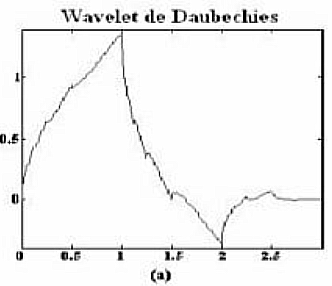
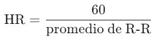
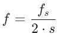
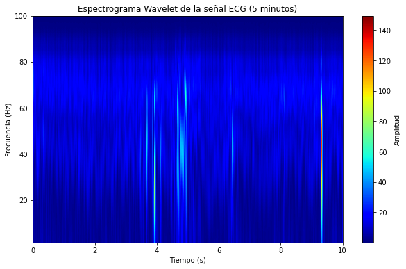
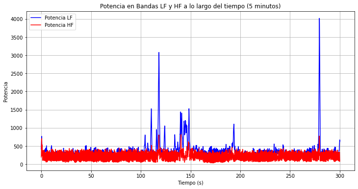

-*
<h1 align="center">ANÁLISIS DE SEÑAL ELECTROMIOGRÁFICA</h1>

<p align="center"> Problema:  Identificación de picos R, e intervalo entre ellos.</p>
<br />
<div align="center">
 
</div>

<br />

La señal ECG es aquella que mide la actividad eléctrica del corazón, en cada latido. Es capaz de medir los cambios de voltaje gracias al flujo de iones que sucede durante la contracción y relajación. Asimismo, cada parte de la señal ECG tiene un significado asociado con el ciclo cardíaco.

Teniendo en cuenta que nos interesa el significado del pico R, se define como la representación de la despolarización máxima de los ventrículos; siendo esta importante para enviar la sangre al resto del cuerpo.

Entonces, ¿qué ocurre durante el intervalo entre cada pico R? Este tiempo representa el periodo completo de un latido cardíaco, a partir del cual se puede calcular la frecuencia cardíaca (un importante indicador de la salud del paciente), y también evaluar su variabilidad (HRV). Pero, ¿para qué? Se profundizará más sobre esto en el marco teórico.


## Tabla de contenidos:
---

- [MARCO TEÓRICO](#marco)
- [OBJETIVO](#objetivo)
- [MONTAJE](#montaje)
- [PROCESAMIENTO DE LAS SEÑALES](#procesamiento)
- [ANÁLISIS DE RESULTADOS](#resultados)
- [APLICACIONES EN BIOMÉDICA](#aplicaciones)


## Marco teórico
---

### Sistema nervioso autónomo

El sistema nervioso autónomo es la parte del sistema nervioso que se encarga de controlar de manera automática las funciones involuntarias del cuerpo. Entre las características que este sistema regula se encuentra el ritmo cardíaco. Este control está presente en todas las situaciones a las que las personas se enfrentan, sin embargo, no todas las respuestas son iguales. Por esta razón, se divide en dos: sistema simpático y parasimpático.

El sistema simpático se activa en situaciones de peligro o estrés, preparando al cuerpo para la acción ("respuesta de lucha o huida"). Uno de sus principales efectos es aumentar la frecuencia cardíaca al liberar noradrenalina. Al latir más rápido el corazón, aumenta el flujo sanguíneo y el suministro de oxígeno a los órganos. Esto se refleja en un acortamiento del intervalo R-R, debido al aumento de la frecuencia cardíaca.

Por otro lado, el sistema parasimpático se activa en situaciones de relajación y descanso, favoreciendo la conservación de energía. Cuando se activa, disminuye la frecuencia de impulsos eléctricos del nodo sinusal (marcapasos cardíaco), lo que reduce el trabajo del corazón. Esto se refleja en un alargamiento del intervalo R-R, ya que la frecuencia cardíaca disminuye.

<div align="center">
 
</div>

### ¿Qué mide la HRV?

La HRV (Heart Rate Variability), o variabilidad de la frecuencia cardíaca, es una medida de los cambios en el tiempo que ocurren entre los latidos del corazón, a esto se le llama frecuencia. Anteriormente, se mencionó cómo el cuerpo se adapta a diferentes situaciones, lo que demuestra su adaptabilidad. Al analizar la HRV, es importante considerar las diferentes bandas de frecuencia, ya que cada una proporciona información sobre características específicas de la señal ECG.

<div align="center">
 
</div>

### Bandas de frecuencia que mide la HRV

Habiendo mencionado anteriormente que las frecuencias medidas por la HRV son equivalentes a las 'velocidades' a las que ocurren las variaciones de los intervalos R-R, es importante aclarar que existen dos bandas de frecuencia principales: baja frecuencia y alta frecuencia.

La banda de baja frecuencia se observa en un rango de 0.04 Hz a 0.15 Hz y se relaciona con cambios lentos en los intervalos R-R. Estos cambios lentos suelen estar asociados con la respuesta del cuerpo a situaciones de estrés o descanso, mientras busca alcanzar la homeostasis.

Por otro lado, la banda de alta frecuencia se encuentra en un rango de 0.15 Hz a 0.4 Hz y está relacionada con cambios rápidos en los intervalos R-R. Principalmente, esta banda se ve influenciada por la respiración, reflejando la regulación que el cuerpo ejerce sobre ella.

Entonces, ¿Cómo es posible medir el avance de dichas frecuencias?, para este objetivo se utiliza la herramienta de la Transformada Wavelet. 

### Transformada Wavelet

La transformada wavelet es una herramienta matemática que nos permite analizar cómo cambian las frecuencias a lo largo de una señal, descomponiéndola en 'escalas' de tiempo y frecuencia. Esto significa que la transformada puede proporcionarnos información sobre qué frecuencias están presentes y en qué momentos de la señal ocurren. Su definición matemática, teniendo en cuenta que se está aplicando una señal continua (es decir, se va a utilizar la Transformada Wavelet Continua) es la siguiente:

<div align="center">
 
</div>

Esta definición nos brinda dos datos de vital importancia para realizar la transformada, siendo así, cada término significa lo siguiente: 

> CWT(a,b)

Representa el coeficiente de la transformada Wavelet para una escala **a** y una traslación **b**, cabe recordar que la escala se relaciona con el cambio en la frecuencia, y la traslación con el movimiento en el eje x.

> 1/√a

Es el factor de normalización encargado de que la energía de la señal Wavelet no cambie junto con la variación en la escala. 

> f(t)

Es la señal que se quiere someter a la transformada Wavelet.


> ψ((t-b)/a)

Es la función Wavelet madre (es decir, la Wavelet sin ninguna modificación), pero, escalada en **a**, desplazada en **b** y evaluada en el tiempo **t**. 

Teniendo en cuenta su definición, ahora podemos ver cuáles aplicaciones tiene, y es que, al ser tan poderosa, se usa en campos que van desde la economía hasta la ingeniería. Por ejemplo, en el ámbito de las finanzas, se puede utilizar para analizar la evolución de series temporales financieras en distintas escalas de tiempo, como por ejemplo, las tasas de interés. Se puede aplicar para captar y analizar patrones, lo cual permite una comprensión profunda de las situaciones que pueden afectar al comportamiento económico que se esté considerando. Por otro lado, en el área de la ingeniería, se puede ver aplicada en distintos ámbitos, como en el presente en este laboratorio, de análisis de señales biológicas, o, por ejemplo, en el análisis de imágenes. En el análisis de imágenes se puede utilizar para eliminar información redundante a distintas escalas presente en la imagen que se esté procesando, logrando mejorar la comprensión de la misma sin perder información relevante. Pero, para aplicaciones tan diversas, ¿Siempre se usa la misma Wavelet?, la respuesta es: no. Existen distintos tipos de Wavelets. 

### Tipos de Wavelet 

Como se mencionó anteriormente, existen distintos tipos de wavelets, cada una con características especiales que las hacen aptas para diversas aplicaciones en diferentes áreas. A continuación, se mencionan las más importantes y la que se utilizó en este algoritmo. 

> Wavelet de Haar

Esta señal Wavelet es una muy simple, se basa en una función escalón, y es discontinua. Se puede utilizar para analizar imagenes, detectando estructuras bruscas en las señales que componen las mismas. Sin embargo, no es recomendada para utilizar en señales suaves ó demasiado complejas, por su condición de discontinuidad. 

<div align="center">
 
</div>

> Wavelet Daubechies 

Esta es una Wavelet suave y continua, se divide también en varios tipos, dependiendo de su orden y de su longitud. Se utiliza comunmente en procesamiento de imagenes y audio, puede detectar detalles finos.

<div align="center">
 
</div>

> Wavelet de Morlet  

Esta wavelet, que se asemeja a una señal sinusoidal pero con una forma similar a una campana de Gauss, permite obtener datos como la magnitud y la fase. Gracias a su naturaleza, es capaz de detectar estructuras periódicas en las señales. Por esta razón, se seleccionó para analizar la señal ECG.

<div align="center">
 
</div>


## Objetivo
---

El objetivo de este trabajo fue identificar los picos R de una señal ECG para, posteriormente, analizar la fluctuación temporal de los intervalos R-R en una señal de cinco minutos de duración. Esta información es fundamental para realizar un análisis de la frecuencia cardíaca y detectar posibles anomalías asociadas a enfermedades o síndromes. Para identificar las frecuencias relacionadas con estas fluctuaciones, se empleó la transformada wavelet de Morlet, lo que permitió generar un espectograma y visualizar gráficamente la evolución temporal de las frecuencias.

## Montaje
---

Para la toma de datos, en primer lugar, se obtuvo el consentimiento informado del sujeto de prueba, quien autorizó por escrito el uso y divulgación de los datos de su señal ECG. El documento de consentimiento se encuentra disponible con el nombre "CONSENTIMIENTO_SEÑALES". A continuación, se conectó al sujeto a los electrodos del sensor AD8232 y, mediante comunicación serial entre la STM32 y Python, se adquirieron cinco minutos de datos de la señal ECG. Finalmente, estos datos fueron almacenados en un archivo .txt, el cual servirá como base para el posterior procesamiento y extracción de las características requeridas de la señal.

<div align="center">
 
</div>


## Procesamiento de la señal ECG 
---
### 1. Cargar las librerias que serán utilizadas para procesar la señal 

Se utilizaron diversas librerias, tales como: 

- Numpy: Computación numerica, se utilizó para el procesamiento de matrices, arreglos y funciones matematicas. 
- Matplotlib: Graficacion de las señales. 
- Spicy.signal: Procesamiento de las señales. 
- Pywt: Utilizada para llevar a cabo la transformada Wavelet. 
- Panda: Se utilizó para mostrar de manera ordenada los datos en el panel de Spider, en forma de tablas, facilitando su comprensión. 

```
import numpy as np
import matplotlib.pyplot as plt
import scipy.signal as signal
import pywt
import pandas as pd
```
### 2. Cargar los datos guardados en el archivo .txt

El nombre del archivo de texto es 'juanitados'. Si se utiliza este código, se debe reemplazar por el nombre del archivo .txt correspondiente. Es importante destacar que los datos dentro del archivo están organizados en filas y columnas, por lo que es necesario especificar qué columnas corresponden al tiempo y al voltaje para construir la señal. La frecuencia de muestreo utilizada es de 100 Hz. Esta elección se basa en el teorema de Nyquist, que establece que la frecuencia de muestreo debe ser al menos el doble de la frecuencia máxima de la señal, la cual, según la literatura, oscila alrededor de 50 Hz.

<div align="center">
 
</div>

```
file_path = 'juanitados.txt' 
datos = np.loadtxt(file_path, delimiter=',') 
tiempo = datos[:, 0]  #Tiempo
voltaje = datos[:, 1]  #Voltaje 
fs = 100 #Frecuencia de muestreo (Hz)
```

### 3. Filtrado 

 En esta sección es importante aclarar que, aunque la señal ya ha sido filtrada por los filtros integrados en el sensor AD8232, aún presenta un nivel de ruido considerable. Por lo tanto, se aplicaron tres filtros adicionales para obtener una señal más clara: un pasabanda, un pasa-bajas y un filtro de mediana.

El filtro pasabanda se diseñó para una banda de frecuencia entre 1 Hz y 40 Hz, valores respaldados por la literatura especializada. El objetivo es permitir el paso únicamente de las frecuencias correspondientes a la señal ECG. Para su implementación, se calculó la frecuencia de Nyquist, que es la mitad de la frecuencia de muestreo (50 Hz). Se utilizó una función de diseño Butterworth, ya que este tipo de filtros ofrecen una respuesta plana en la banda pasante, lo que garantiza una atenuación uniforme de las frecuencias fuera de esta banda. En el código, se especificó explícitamente que se deseaba un filtro pasabanda.

> Filtro Pasabanda


El filtro pasabanda se diseñó para una banda de frecuencia entre 1 Hz y 40 Hz, valores respaldados por la literatura especializada. El objetivo es permitir el paso únicamente de las frecuencias correspondientes a la señal ECG. Para su implementación, se calculó la frecuencia de Nyquist, que es la mitad de la frecuencia de muestreo (50 Hz). Se utilizó una función de diseño Butterworth, ya que este tipo de filtros ofrecen una respuesta plana en la banda pasante, lo que garantiza una atenuación uniforme de las frecuencias fuera de esta banda. En el código, se especificó explícitamente que se deseaba un filtro pasabanda.


```
lowcut = 1.0
highcut = 40.0
nyq = 0.5 * fs
low = lowcut / nyq
high = highcut / nyq

b, a = signal.butter(4, [low, high], btype='band')
ecg_filtered = signal.filtfilt(b, a, voltaje)
```

> Filtro Pasabaja

A pesar de aplicar el filtro pasabanda, la señal aún presentaba ruido. Por esta razón, se decidió aplicar un filtro pasa-bajas con una frecuencia de corte de 40 Hz. El objetivo de este filtro era eliminar las componentes de frecuencia superiores a 40 Hz, refinando aún más el rango de frecuencias de interés. La implementación del filtro pasa-bajas fue similar a la del pasabanda, especificando únicamente que se deseaba un filtro de tipo pasa-bajas.


```
cutoff_low = 40.0
low = cutoff_low / nyq
b_low, a_low = signal.butter(4, low, btype='low')
ecg_filtered = signal.filtfilt(b_low, a_low, ecg_filtered)
```

> Filtro de mediana 

Posteriormente, para preservar los detalles importantes de la señal y suavizar los bordes de manera efectiva, se optó por aplicar un filtro de mediana. Este tipo de filtro no lineal es especialmente útil para suavizar señales sin perder los bordes o la nitidez, lo cual es fundamental para la detección precisa de los picos R. Además, su implementación es sencilla y su cálculo es computacionalmente eficiente. Matemáticamente, el filtro de mediana divide la señal en ventanas deslizantes y, para cada ventana, calcula la mediana de los valores. A continuación, el valor central de cada ventana se reemplaza por la mediana calculada, lo que tiene el efecto de suavizar la señal preservando sus características principales. Esto lo hace guiado por el tamaño del "Kernel", que no es más que el número de datos que se utilizarán por ventana, en este caso, se eligieron 5 datos; siendo esto efectivo por su tamaño medio, asegurando el suavizado de la señal, pero también, la preservación de datos importantes.

```
ecg_filtered = signal.medfilt(ecg_filtered, kernel_size=5)
```

### 4. Detección de picos R

Una vez obtenida la señal filtrada, se procede a detectar los picos R utilizando la función **find_peaks** de la biblioteca **scipy.signal**. Esta función requiere principalmente dos parámetros para identificar los máximos locales: una altura mínima y una distancia mínima entre picos. La altura mínima se establece como un múltiplo de la media de la señal, en este caso, 1.5 veces la media, con el objetivo de detectar solo los picos más prominentes. Por otro lado, considerando que el intervalo promedio entre picos R-R en un adulto sano es de aproximadamente 0.6 segundos, se utiliza este valor como distancia mínima entre picos, asegurando así que se identifiquen correctamente los complejos QRS.

```
peaks, _ = signal.find_peaks(ecg_filtered, height=np.mean(ecg_filtered) * 1.5, distance=fs * 0.6)
rpeaks_times = peaks / fs  
```
Luego de que la señal haya sido filtrada, y los picos R identificados, se ve de la siguiente manera:

<div align="center">
 
</div>

### 5. Cálculo de tiempo entre picos R-R

Para determinar la duración de cada intervalo R-R, se empleó la función **np.diff** de la biblioteca NumPy. Previamente, se almacenaron los instantes de tiempo correspondientes a los picos R en un arreglo denominado rpeaks_times, expresados en segundos. La función np.diff calcula la diferencia entre elementos consecutivos de este arreglo, obteniendo así la duración de cada intervalo R-R. Posteriormente, se realizó un análisis estadístico de estos intervalos, calculando el valor promedio y la desviación estándar. Este análisis es fundamental, ya que permite evaluar la variabilidad de la frecuencia cardíaca y obtener información relevante sobre la salud cardiovascular del paciente. Por ejemplo, conociendo el valor promedio del intervalo R-R, es posible calcular la frecuencia cardíaca promedio utilizando la siguiente relación:

<div align="center">
 
</div>

```
rr_intervals = np.diff(rpeaks_times)  
mean_rr = np.mean(rr_intervals)  
std_rr = np.std(rr_intervals)  
```

Los resultados obtenidos fueron los siguientes: 

- Promedio de intervalos R-R: 0.76 segundos.
- Desviación estándar: 0.10 segundos.
- Frecuencia cardiaca: aprox 0.79 bpm. 

### 6. Transformada Wavelet Continua 

Para realizar un análisis de frecuencias a lo largo del tiempo, considerando que nuestra señal es continua, se optó por utilizar una transformada wavelet continua. En particular, se seleccionó la wavelet de Morlet, implementada en la biblioteca PyWavelets (pywt). Inicialmente, se definió un rango de escalas de 1 a 64, con incrementos de 1.0; así, se logra un barrido de frecuencias que va desde los 0.8Hz a los 50Hz, rango en el cual se encuentra la información de interés. Las escalas están directamente relacionadas con la frecuencia de la señal: a mayor escala, menor frecuencia y viceversa. Esta elección de escalas se basa en la relación entre la escala y la frecuencia, que es característica de cada tipo de wavelet, que es la siguiente: 

<div align="center">
 
</div>

Por lo tanto, se especifica en el código que la función wavelet a utilizar es **Morlet**, con la sintaxis 'cmor1.5-1.0'. Estos parámetros ajustan el ancho de banda y la frecuencia central de la wavelet. Se seleccionaron los valores 1.5 y 1.0, respectivamente, ya que permiten capturar tanto componentes de frecuencia bajas (cambios lentos) como altas (cambios rápidos). Este rango de valores es comúnmente utilizado en el análisis de señales ECG. Un ancho de banda adecuado garantiza una buena resolución temporal y frecuencial, mientras que una frecuencia central adecuada permite centrarse en las bandas de frecuencia de interés en la señal ECG.

```
scales = np.arange(1.0, 64.0, 1.0)  
wavelet = 'cmor1.5-1.0' 
```
Al gráficar el espectrograma con los resultados obtenidos luego de aplicar la transformada, se obtiene lo siguiente: 


<div align="center">
 
</div>

Al observar la imagen, se puede apreciar que la mayor parte de la energía de la señal se concentra alrededor de los 40 Hz, lo cual es coherente con lo esperado en una señal ECG. Sin embargo, también se detecta una presencia de energía en frecuencias superiores a 40 Hz, lo que podría atribuirse a la presencia de ruido o artefactos no filtrados completamente. No obstante, la concentración principal de energía se mantiene en torno a los 40 Hz. Además, se identifican patrones repetitivos que corresponden a cada latido cardíaco, lo que indica una buena calidad de la señal.

### 7: Potencia en bandas de frecuencia 

La señal ECG presenta un amplio espectro de frecuencias. Para analizarla en detalle, se suele dividir en bandas: una de baja frecuencia y otra de alta frecuencia. Cada banda aporta información sobre diferentes aspectos de la función cardíaca. La banda de alta frecuencia se relaciona típicamente con la actividad respiratoria y la influencia del sistema nervioso parasimpático, mientras que la banda de baja frecuencia se asocia con la variabilidad de la frecuencia cardíaca, la regulación cardiovascular y la interacción entre los sistemas nervioso simpático y parasimpático. En el código, se establecieron límites específicos para estas bandas: de 0.5 Hz a 2.0 Hz para la banda baja y de 2.0 Hz a 5.0 Hz para la banda alta. Estos valores fueron determinados visualizando las frecuencias asociadas a cada escala de la transformada wavelet. 

```
freqs = fs / (2 * scales) 
print("Frecuencias asociadas a las escalas:", freqs)
lf_band = np.logical_and(freqs >= 0.5, freqs <= 2.0)  
hf_band = np.logical_and(freqs >= 2.0, freqs <= 5.0)
lf_power = np.trapz(np.abs(coefficients[lf_band, :]), axis=0)
hf_power = np.trapz(np.abs(coefficients[hf_band, :]), axis=0)
lf_hf_ratio = np.mean(lf_power) / np.mean(hf_power)

```
Al haber realizado el cálculo y obtenido los resultados, se muestra que: 

- Potencia promedio en banda LF: 373.2756
- Potencia promedio en banda HF: 211.5370
- Relación LF/HF: 1.7646

Estos resultados nos indican diversos factores. Por ejemplo, un valor elevado de potencia en la banda de baja frecuencia sugiere un aumento en la actividad del sistema nervioso simpático, lo que se traduce en un incremento del flujo sanguíneo y de la frecuencia cardíaca. Este hallazgo es coherente con el protocolo experimental, ya que el sujeto fue sometido a preguntas incómodas durante la adquisición de los datos, lo cual pudo haber generado una respuesta de estrés. Por otro lado, la baja potencia en la banda de alta frecuencia indica que, aunque el organismo intentó regular estos cambios fisiológicos mediante la activación del sistema nervioso parasimpático, esta respuesta no fue suficiente para contrarrestar completamente los efectos de la actividad simpática. Lo anterior se confirma con el resultado de la relación LF/HF, observando que se obtuvo un resultado mayor a 1, se sabe que existe predominación del sistema simpático sobre el parasimpático. 

Para finalizar, al gráficar el comportamiento de las frecuencias en el tiempo se obtiene lo siguiente: 

<div align="center">
 
</div>

En esta gráfica se observa que los valores de potencia en la banda de baja frecuencia (LF) superan consistentemente a los de la banda de alta frecuencia (HF), lo cual confirma los hallazgos anteriores. Se identifican picos aislados, alejados de la tendencia general de los datos, que podrían corresponder a momentos en los que el sujeto experimentó emociones intensas (como risa o nerviosismo) y sus movimientos generaron artefactos en la señal. Sin embargo, a pesar de estos eventos transitorios, la dominancia de la potencia en la banda de baja frecuencia se mantiene.

### Paso 8: Análisis espectral

```
N1 = len(timepim)
T1 = 1.0 / Fs1

N2 = len(timepum)
T2 = 1.0 / Fs2

N3 = len(timepam)
T3 = 1.0 / Fs3

Nr1 = len(timepim1)
Tr1 = 1.0 / Fr1

Nr2 = len(timepum2)
Tr2 = 1.0 / Fr2

Nr3 = len(timepam3)
Tr3 = 1.0 / Fr3

yf_pim= fft(pim)
yf_pum = fft(pum)
yf_pam = fft(pam)
yf_pim1 = fft(pim1)
yf_pum2 = fft(pum2)
yf_pam3 = fft(pam3)

xf_pim = fftfreq(N1, T1)[:N1//2]
xf_pum = fftfreq(N2, T2)[:N2//2]
xf_pam = fftfreq(N3, T3)[:N3//2]
xf_pim1 = fftfreq(Nr1, Tr1)[:Nr1//2]
xf_pum2 = fftfreq(Nr2, Tr2)[:Nr2//2]
xf_pam3 = fftfreq(Nr3, Tr3)[:Nr3//2]

plt.figure(figsize=(10, 6))

plt.plot(xf_pim, 2.0/N1 * np.abs(yf_pim[:N1//2]), label='Voces Toma 1', color='blue')
plt.plot(xf_pum, 2.0/N2 * np.abs(yf_pum[:N2//2]), label='Voces Toma 2', color='green')
plt.plot(xf_pam, 2.0/N3 * np.abs(yf_pam[:N3//2]), label='Voces Toma 3', color='red')

plt.plot(xf_pim1, 2.0/Nr1 * np.abs(yf_pim1[:Nr1//2]), label='Ruido Toma 1', color='orange')
plt.plot(xf_pum2, 2.0/Nr2 * np.abs(yf_pum2[:Nr2//2]), label='Ruido Toma 2', color='yellow')
plt.plot(xf_pam3, 2.0/Nr3 * np.abs(yf_pam3[:Nr3//2]), label='Ruido Toma 3', color='purple')

plt.title("Análisis Espectral usando FFT de Todas las Señales")
plt.xlabel("Frecuencia [Hz]")
plt.ylabel("Amplitud [dB]")
plt.legend()
plt.show()
```
La gráfica realizada es la siguiente: 

<br />
<div align="center">
 
</div>

### Paso 7: Visualización de la voz filtrada

```
plt.figure(figsize=(12, 6))
plt.plot(voz_filtrada_mejorada, color='violet')
plt.legend()
plt.title("Voz Filtrada usando ICA & Filtro Pasa Banda")
```

La gráfica de la voz filtrada es la siguiente: 

<br />
<div align="center">
 
</div>

Audio con la voz filtrada: [SoundCloud audio player](https://on.soundcloud.com/NhbaJE7aAdKrAETA7)


 	
## Resultados
---

> SNR

Al momento de realizar el cálculo de las señales con sus respectivos ruidos, los resultados obtenidos fueron los siguientes: 

```
El SNR entre la señal de audio 1 y el ruido 1 es: 32.80 dB
El SNR entre la señal de audio 2 y el ruido 2 es: 44.29 dB
El SNR entre la señal de audio 3 y el ruido 3 es: 27.14 dB
El SNR entre Vocecita y el ruido 1 es: 33.48 dB
El SNR entre Vocecita y el ruido 2 es: 48.81 dB
El SNR entre Vocecita y el ruido 3 es: 31.89 dB
```
Siendo Vocecita la mezcla de las tres señales adquiridas. 

El análisis de los valores de SNR revela que tanto el filtrado pasabanda como el Análisis de Componentes Independientes (ICA) han contribuido a mejorar sustancialmente la calidad de la señal de audio. El filtrado ha eliminado las frecuencias no deseadas, mientras que ICA ha permitido separar de manera efectiva las fuentes de audio mezcladas. La señal resultante presenta una relación señal-ruido significativamente mayor, lo que indica una reducción efectiva del ruido y una mayor claridad en la señal de voz. Así mismo, el aumento del SNR después del procesamiento indica que la señal de voz filtrada es menos susceptible a interferencias y, por lo tanto, más adecuada para aplicaciones posteriores, como el reconocimiento de voz o la compresión de audio. Los resultados obtenidos demuestran la eficacia de las técnicas empleadas para mejorar la calidad de la señal.


> Análisis temporal y espectral

El análisis temporal de la señal indica la variación de la misma a lo largo del tiempo, entonces, permite identificar la presencia de ruido y la observación del patrón que siguen las voces, esto teniendo en cuenta que en todas las grabaciones, las personas están diciendo las mismas cosas. Por otro lado, en el análisis espectral se pueden identificar las frecuencias predominantes de la señal.

### Aplicaciones

La biomedicina ha experimentado una revolución gracias al avance de las tecnologías de procesamiento de señales. Al aplicar técnicas sofisticadas de filtrado y análisis a los datos biológicos, los investigadores y médicos pueden obtener una visión más profunda de las enfermedades y desarrollar tratamientos más efectivos. Desde la detección temprana del cáncer hasta la mejora de la calidad de vida de pacientes con enfermedades crónicas, estas herramientas están transformando la forma en que entendemos y tratamos las enfermedades.
